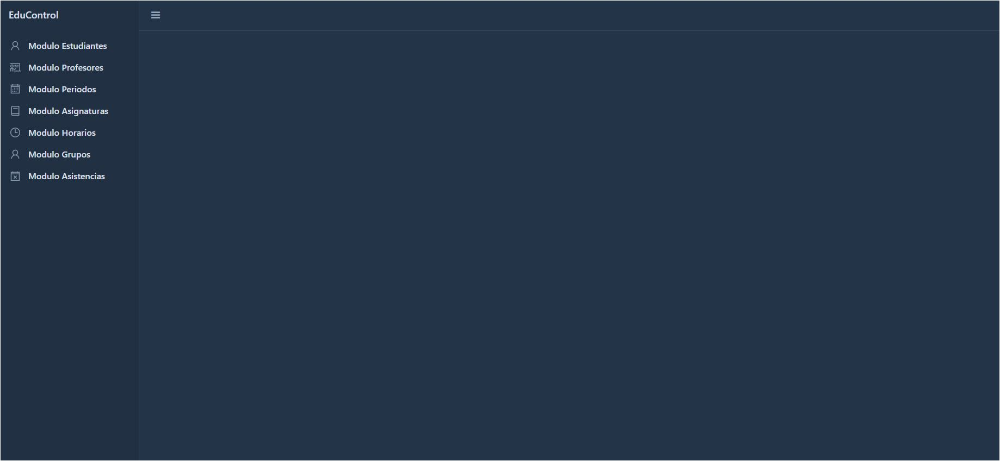
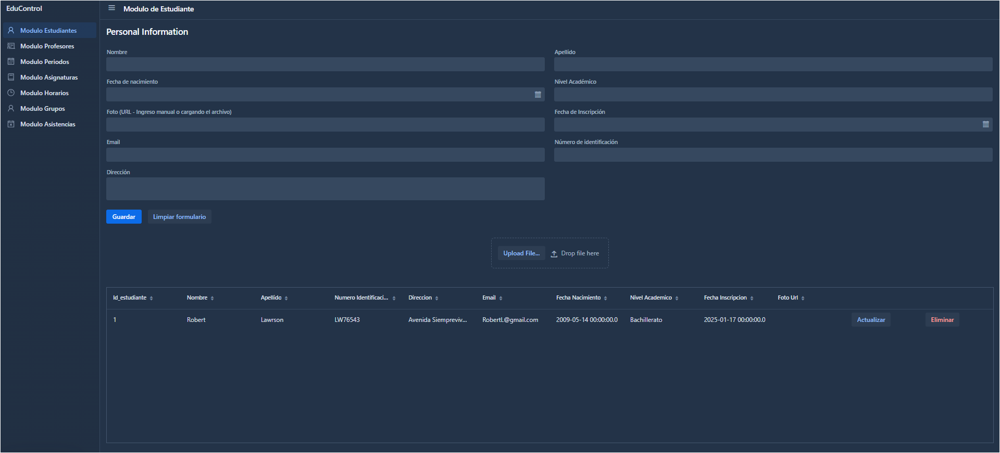
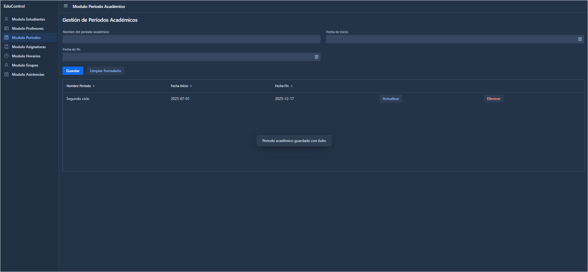
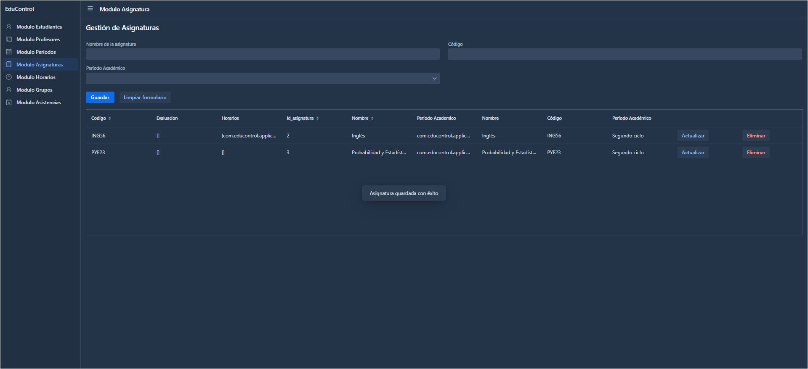
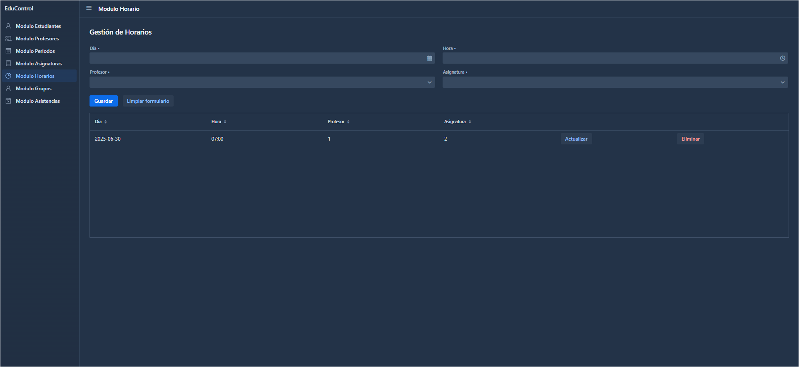
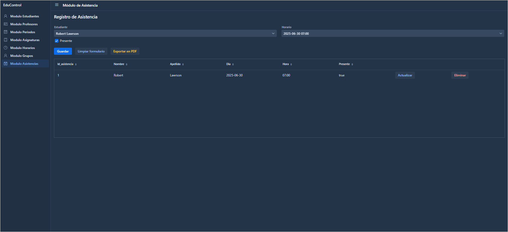

# EduControl 🎓📚

**EduControl** es una aplicación web desarrollada con **Java 17**, **Spring Boot**, **Vaadin 24**, **Hibernate (JPA)** y **MariaDB**, diseñada para facilitar la gestión académica en centros educativos. La arquitectura está organizada en capas: `modelos`, `controlador`, `servicios` y `views`. Ofrece una interfaz moderna, validaciones integradas, confirmaciones de acciones, importación de datos desde Excel, y exportación en PDF.

---

## 🛠 Tecnologías principales

- Java 17
- Spring Boot
- Vaadin 24
- Hibernate (JPA)
- MariaDB 
- Apache POI (importación Excel)
- iText (exportación PDF)
- Maven

---

## Módulos implementados

### Estudiantes
- Registro de estudiantes con nombre, apellido, correo... etc
- Validación de campos y confirmación al eliminar.
- Grid para actualizar o eliminar datos.

### Profesores
- Formulario de profesores: nombre, apellido, email, ID, especialidad, dirección.
- Importación desde archivos `.xlsx`.
- Confirmación para eliminación, notificaciones y actualizaciones.

### Períodos Académicos
- Registro de nombre, fecha de inicio y fin.
- Manejo de fechas con `DatePicker` y validación.
- Confirmación para eliminar y feedback inmediato.

### Asignaturas
- CRUD de asignaturas con validaciones.
- Interfaz limpia, confirmación de acciones y notificaciones.

### Horarios
- Asignación de día, hora, profesor y asignatura.
- ComboBoxes dinámicos conectados con otras entidades.
- Validación con `Binder`, actualizaciones y eliminaciones seguras.

### Grupos
- Asociación de estudiantes a un horario específico.
- Visualización de horario y estudiante asociados.
- Configuración de `ComboBox` y validaciones con `Binder`.

### Asistencias
- Registro de asistencia por estudiante y horario.
- Checkbox de presente/ausente.
- Exportación a PDF con estilo personalizado.
- Confirmación antes de eliminar un registro.

---

## Características adicionales 

- Validaciones en todos los formularios (campos obligatorios, formatos).
- Confirmación antes de eliminar elementos (`ConfirmDialog`).
- Notificaciones claras y centradas (`Notification.show()`).
- Importación de profesores desde Excel (`.xlsx`) con Apache POI.
- Exportación de asistencias a PDF con iText y descarga directa.
- Interfaz amigable, basada en `FormLayout`, `Grid`, `ComboBox`, `Dialog`, `TimePicker`, etc.

---

## Cómo ejecutar el proyecto

1. Clona el repositorio:
   ```bash
   git clone https://github.com/martkevz/Educontrol.git
   ``` 
2. Crea la base de datos educontrol.
  
3. Edita src/main/resources/application.properties:
    ```bash 
    spring.datasource.url=jdbc:mysql://localhost:3306/educontrol
    spring.datasource.username=TU_USUARIO
    spring.datasource.password=TU_PASSWORD
    spring.jpa.hibernate.ddl-auto=create
   ```
    
5. Construye y corre con Maven:
   ```bash 
    mvn clean package
   ```
   ```bash 
   mvn spring-boot:run
   ```
6. Abre http://localhost:8080 desde tu navegador.

---

## *Capturas de Pantalla*

Inicio: 

<div style="display: flex; flex-wrap: wrap; gap: 20px; justify-content: center;">



### 1. Módulo Estudiantes:


### 2. Módulo Profesores:


### 3. Módulo Periodos:


### 4. Módulo Asignaturas:


### 5. Módulo Horarios:


### 6. Módulo Grupos:


### 7. Módulo Asistencias:

<div/>

---

## 👥 Equipo de desarrolladores

Kevin Martínez  – martinezguillenk5@gmail.com

Jennifer Pleitez – jennjennp7@gmail.com

---

## Licencia

Código disponible bajo licencia MIT. Verifica detalles en el archivo [LICENSE](https://github.com/martkevz/Educontrol/blob/main/LICENSE.md).
Proyecto académico sin fines comerciales. Puedes modificarlo y adaptarlo con fines educativos.

---

